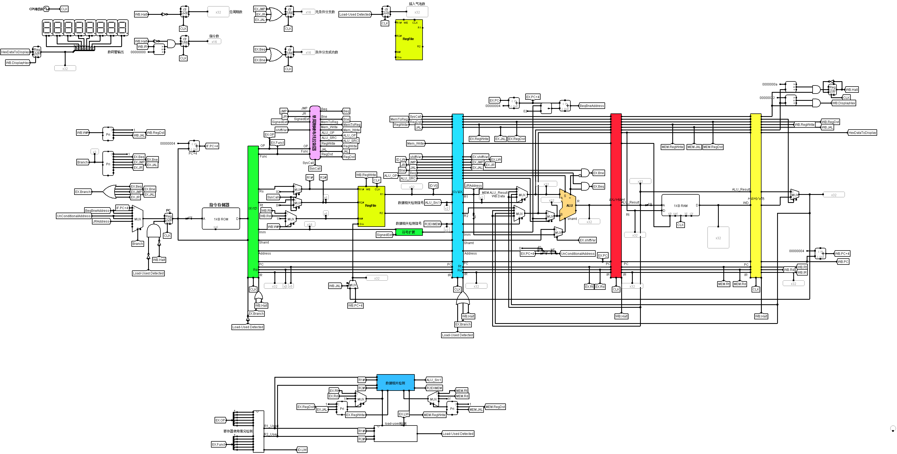
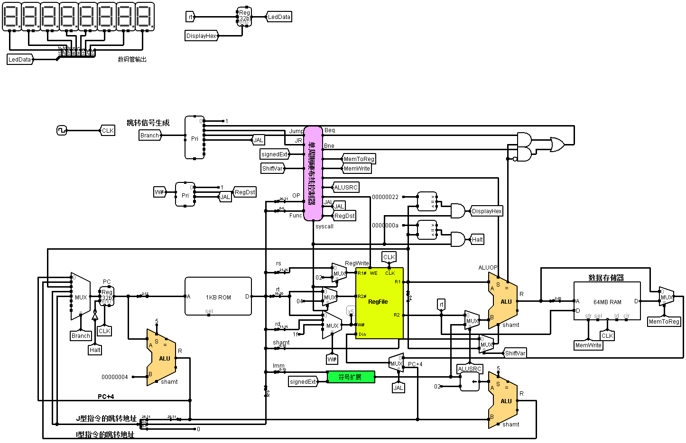

# Pipeline-CPU

在本设计中，采用了MIPS32架构，选取了常用的**31条**MIPS指令作为指令集，在logsim平台中，从设计**单周期**CPU出发，逐步将单周期CPU改造为**五段流水线CPU**

- 五段流水线是将一条指令的执行过程划分为**取指**、**译码**、**执行**、**访存**、**写回**五个阶段
- 采用**插入气泡**法解决了**分支冒险**
- 采用**重定向技术**解决了**数据冒险**
- 对装载-使用型（load-used）特殊数据冒险采用了**插入气泡法**处理
- 基于支持的指令集编写程序验证CPU设计的正确性，经验证可以正确执行走马灯、冒泡排序等程序，在一定程度上说明CPU设计的正确性

## 支持的指令（31条）

R型指令17条：add,addu,sub,subu,and,or,xor,nor,slt,sltu,sll,srl,sra,sllv,srlv,srav,jr

I型指令12条：addi,addiu,andi,ori,xori,lw,sw,beq,bne,slti,sltiu

J型指令2条：j,jal

syscall(只支持打印16进制数以及停机)

|                 NAME                 | MENEMONIC | FORMAT |                       OPERATION                        |
| :----------------------------------: | :-------: | :----: | :----------------------------------------------------: |
|                 Add                  |    add    |   R    |                 R[rd] = R[rs] + R[rt]                  |
|             Add Unsigned             |   addu    |   R    |                 R[rd] = R[rs] + R[rt]                  |
|               Subtract               |    sub    |   R    |                 R[rd] = R[rs] - R[rt]                  |
|          Subtract Unsigned           |   subu    |   R    |                 R[rd] = R[rs] - R[rt]                  |
|                 And                  |    and    |   R    |                 R[rd] = R[rs] & R[rt]                  |
|                  Or                  |    or     |   R    |                  R[rd] = R[rs]\|R[rt]                  |
|             Exclusive OR             |    xor    |   R    |                  R[rd] = R[rs]^R[rt]                   |
|                 Nor                  |    nor    |   R    |                R[rd] = ~ (R[rs]\|R[rt])                |
|            Set Less Than             |    slt    |   R    |            R[rd] = (R[rs] < R[rt]) ? 1 : 0             |
|         Set Less Than Unsig.         |   sltu    |   R    |            R[rd] = (R[rs] < R[rt]) ? 1 : 0             |
|          Shift Left Logical          |    sll    |   R    |                 R[rd] = R[rt] << shamt                 |
|         Shift Right Logical          |    srl    |   R    |                 R[rd] = R[rt] >> shamt                 |
|          Shift Right Arith.          |    sra    |   R    |                R[rd] = R[rt] >>> shamt                 |
|   Shift Word Left Logical Variable   |   sllv    |   R    |                 R[rd] = R[rt] << R[rs]                 |
|  Shift Word Right Logical Variable   |   srlv    |   R    |                 R[rd] = R[rt] >> R[rs]                 |
| Shift Word Right Arithmetic Variable |   srav    |   R    |                R[rd] = R[rt] >>> R[rs]                 |
|            Jump Register             |    jr     |   R    |                        PC=R[rs]                        |
|            Add Immediate             |   addi    |   I    |               R[rt] = R[rs] + SignExtImm               |
|          Add Imm. Unsigned           |   addiu   |   I    |               R[rt] = R[rs] + SignExtImm               |
|            And Immediate             |   andi    |   I    |               R[rt] = R[rs] & ZeroExtImm               |
|             Or Immediate             |    ori    |   I    |              R[rt] = R[rs] \| ZeroExtImm               |
|        Exclusive OR Immediate        |   xori    |   I    |               R[rt] = R[rs] ^ ZeroExtImm               |
|           Load Upper Imm.            |    lui    |   I    |                  R[rt] = {imm, 16’b0}                  |
|              Load Word               |    lw     |   I    |              R[rt] = M[R[rs]+SignExtImm]               |
|              Store Word              |    sw     |   I    |              M[R[rs]+SignExtImm] = R[rt]               |
|           Branch On Equal            |    beq    |   I    |  if(R[rs]==R[rt])                  PC=PC+4+BranchAddr  |
|         Branch On Not Equal          |    bne    |   I    | if(R[rs]!=R[rt])                    PC=PC+4+BranchAddr |
|          Set Less Than Imm.          |   slti    |   I    |          R[rt] = (R[rs] < SignExtImm)? 1 : 0           |
|      Set Less Than Imm.Unsigned      |   sltiu   |   I    |          R[rt] = (R[rs] < SignExtImm)? 1 : 0           |
|                 Jump                 |     j     |   J    |                      PC=JumpAddr                       |
|            Jump And Link             |    jal    |   J    |                 R[31]=PC+8;PC=JumpAddr                 |

## Demo

流水线CPU电路图

单周期CPU电路图

## 运行方法

下载软件目录下的logsim（该软件运行需要Java环境），用logsim打开当前目录下的`Pipeline-CPU.circ`文件，在左侧选择main子电路，windos下`ctr + k`，时钟连续运行，CPU开始运行提前加载好的程序，程序位于`./汇编工具及测试用例/benchmark.asm`